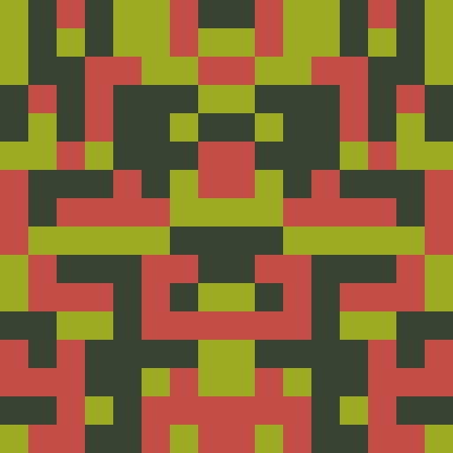
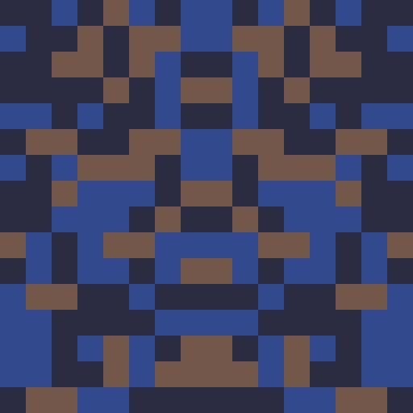
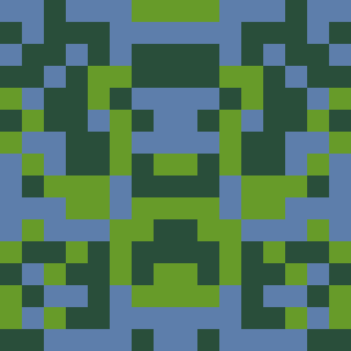
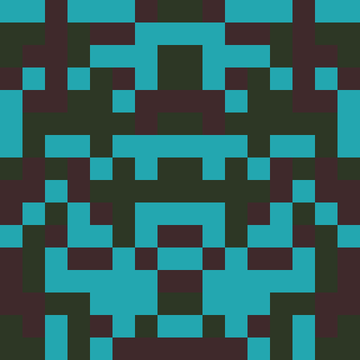

# IdentiGen
An identicon generator written in Python. Works for the command line or as a class you can use in your code.
Version: v1.0.0

## Table of Contents
* [Overview](#overview)
* [Examples](#examples)
* [Current Features](#current-features)
* [Roadmap](#roadmap)
* [Requirements](#requirements)
* [Installation](#installation)
* [How to Use](#how-to-use)
  - [Using IdentiGen from the command line](#using-identigen-from-the-command-line)
  - [Using IdentiGen in a Python program](#using-identigen-in-a-python-program)
* [License](#license)

## Overview
IdentiGen generates identicons using the SHA-512 hash function applied to a given string, and stores the identicons in a specified filepath. By default, IdentiGen generates a 16x16 identicon composed of 3 colors with saturation and value above 51 and below 204.

## Examples
Example 1                    | Example 2                    | Example 3                    | Example 4
:---------------------------:|:----------------------------:|:----------------------------:|:---------------------------:
 |  |  | 

## Current Features
* Generate identicons composed of a specified number of colors within a given HSV color range
* Generate identicons with horizontal, vertical, and quarter symmetry
* Generate identicons from the command line on Linux, Windows, and macOS
* Generate identicons in a Python program

## Roadmap
* Generate identicons from a user-provided hash, rather than from a string which is to be hashed
* Generate identicons using a user-specified hash function instead of SHA-512
* Generate identicons using an arbitrary base size of at least 8x8, rather than only generating a 16x16 base and scaling it up

## Requirements
* Python 3.5+
* Numpy
* OpenCV

## Installation
Install IdentiGen by downloading the package and placing it in your PATH.

## How to Use
### Using IdentiGen from the command line
```
usage: identigen.py [-h] [-sym SYMMETRY] [-w WIDTH] [-c COLORS] [-min HSVMIN]
                    [-max HSVMAX]
                    string directorypath

Generate an identicon from a given string.

positional arguments:
  string                a string from which to generate an identicon
  directorypath         the path to the directory in which to write generated
                        identicons

optional arguments:
  -h, --help            show this help message and exit
  -sym SYMMETRY, --symmetry SYMMETRY
                        the integer representing the type of symmetry desired
                        (horizontal=1, vertical=2, quarter=3)
  -w WIDTH, --width WIDTH
                        the desired pixel width of the identicon (at least 16)
  -c COLORS, --colors COLORS
                        the number of colors from which to create the
                        identicon
  -min HSVMIN, --hsvmin HSVMIN
                        the minimum percentages of hue, saturation, and value
                        from which to generate colors
  -max HSVMAX, --hsvmax HSVMAX
                        the maximum percentages of hue, saturation, and value
                        from which to generate colors
```
* For example, to generate a 512x512 identicon composed of 4 colors with vertical symmetry, minimum 30% saturation, and maximum 70% saturation, for the string ```IdentiGen Example``` to be saved in the directory ```identicons```, you would use the following command:
```
python identigen.py -sym 2 -w 512 -c 4 -min (0.0, 0.3, 0.0) -max (1.0, 0.7, 1.0) "IdentiGen Example" "identicons"
```

### Using IdentiGen in a Python program
```python
from identigen.identigen import IdenticonGenerator
import numpy

idgen = IdenticonGenerator()
image = idgen.generate(string, symmetry=1, img_width=16, color_count=3, hsv_percent_min=(0.0, 0.2, 0.2), hsv_percent_max=(1.0, 0.8, 0.8))
```
* For example, to generate a 512x512 identicon composed of 4 colors with vertical symmetry, minimum 30% saturation, and maximum 70% saturation, for the string ```IdentiGen Example```, you would use the following code:
```python
idgen.generate("IdentiGen Example", symmetry=2, img_width=512, color_count=4, hsv_percent_min=(0.0, 0.3, 0.0), hsv_percent_max=(1.0, 0.7, 1.0))
```

## License
IdentiGen is distributed under the terms of the [GNU GPLv3 License](https://choosealicense.com/licenses/gpl-3.0/).
